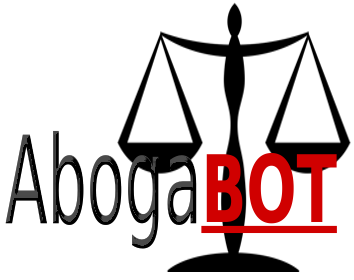
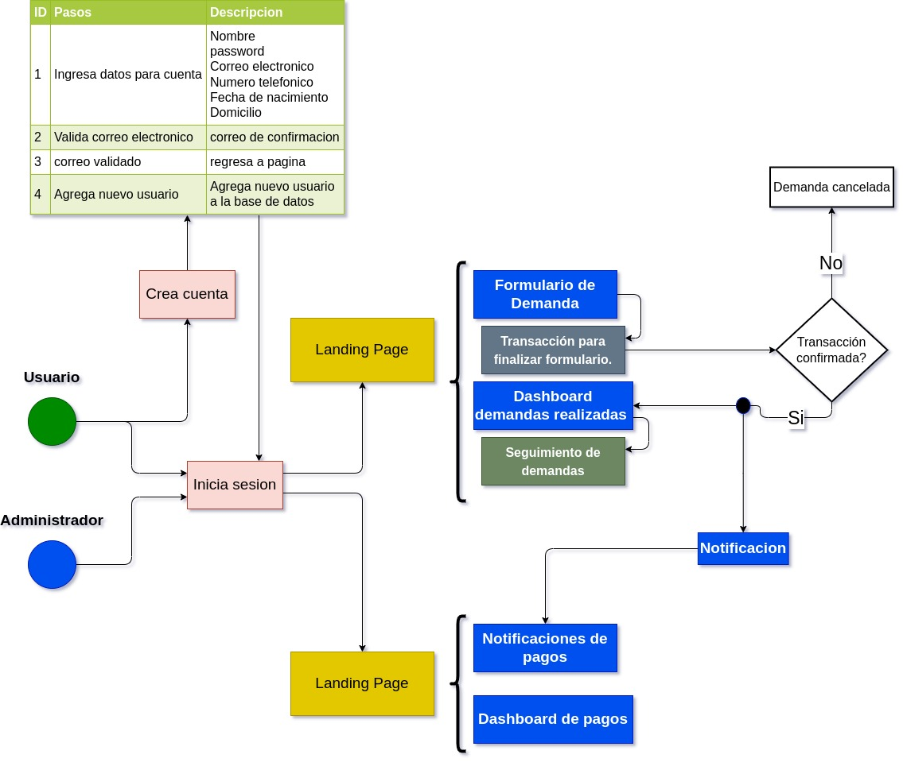
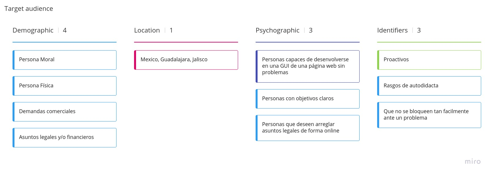

# Contenido
- [Contenido](#contenido)
- [Caso de estudio: Abogabot](#caso-de-estudio-abogabot)
	- [Especificación de requerimientos](#especificación-de-requerimientos)
	- [Diagrama](#diagrama)
	- [Audiencia Objetivo](#audiencia-objetivo)
	- [Wireframes](#wireframes)
  
# Caso de estudio: Abogabot

Para un despacho de abogados se requiere una página web que permita a los usuarios realizar demandas de forma automatizada así como facilitarle a los abogados que tengan una forma rápida de visualizar las demandas que se han realizado. El objetivo es la automatización de la realización de demandas a través de una página web.

## Especificación de requerimientos

Se tiene más informacion del caso en la 
[especificación de requerimientos](https://github.com/AlexString/LaunchX-InnovaccionVirtual-FrontEndCourse_FirstWeek/blob/master/especificacion_requerimientos.pdf).

## Diagrama

## Audiencia Objetivo

## Wireframes

[Los wireframes realizados se encuentran aquí](https://github.com/AlexString/LaunchX-InnovaccionVirtual-FrontEndCourse_FirstWeek/tree/master/wireframes).