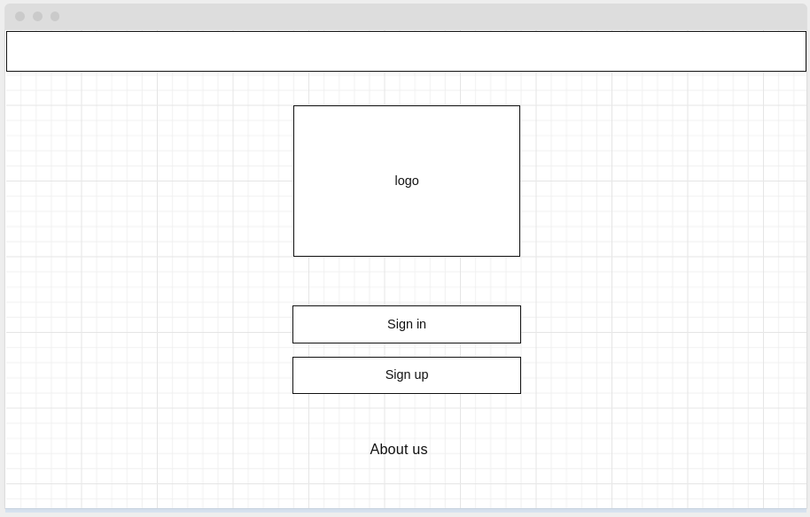

# Contenido
- [Contenido](#contenido)
- [Wireframe](#wireframe)
- [Wireframes de la aplicación a desarrollar](#wireframes-de-la-aplicación-a-desarrollar)
	- [Login](#login)
	- [Wireframes de Usuario](#wireframes-de-usuario)
		- [Demanda - Nueva demanda](#demanda---nueva-demanda)
			- [Demanda - Pagar demanda](#demanda---pagar-demanda)
		- [Dashboard - Demandas](#dashboard---demandas)
		- [Dashboard - Detalles de demanda](#dashboard---detalles-de-demanda)
	- [Wireframes de Administrador](#wireframes-de-administrador)
		- [Dashboard - Demandas](#dashboard---demandas-1)
		- [Dashboard - Pagos](#dashboard---pagos)

# Wireframe

"Un wireframe es una presentación visual estática de baja fidelidad del sitio web. También, en el ámbito del diseño de aplicaciones móviles y el desarrollo de páginas web, es el punto fundamental por seguir para la aplicación o el sitio web." 
*[Edrawsoft](https://www.edrawsoft.com/es/wireframe/)*

# Wireframes de la aplicación a desarrollar

## Login

## Wireframes de Usuario 

### Demanda - Nueva demanda

___

___

#### Demanda - Pagar demanda

___

### Dashboard - Demandas

___

### Dashboard - Detalles de demanda

## Wireframes de Administrador

### Dashboard - Demandas

### Dashboard - Pagos

